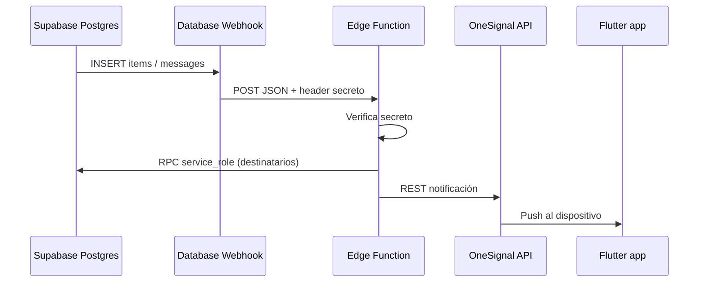

# Push con OneSignal + Supabase (webhook) — guía simplificada (ReNomada)

Tutorial para sustituir la cadena **FCM + n8n + cuenta de servicio Google** por **OneSignal** como único proveedor de push. Puedes disparar envíos con **Supabase Database Webhooks** (recomendado para producción) o, para un **MVP**, con un **digest diario** desde n8n (sección 2). **Paso a paso, SQL y workflow listos:** [push-daily-digest-onesignal/README.md](push-daily-digest-onesignal/README.md).

## 1. Por qué simplifica

| Antes (FCM + n8n) | Con OneSignal |
|-------------------|---------------|
| Firebase (VAPID, SW web, `google-services.json`, APNs) + n8n + credencial Google Service Account + RPC Supabase | **OneSignal** (SDK + REST API) + **una** función serverless + mismas RPC en Postgres |
| Varios secretos en distintos sitios | Secretos solo en **variables de entorno** del backend (Edge Function) |

La app sigue usando Supabase para auth y datos; el backend solo resuelve *a quién* notificar (RPC existentes) y pide el envío a OneSignal.

## 2. Alternativa MVP — digest diario con n8n (cron)

Idea: **no** usar Database Webhooks; en n8n un nodo **Schedule** se ejecuta **una vez al día** a una hora fija, llama a **dos RPC en Supabase** (con credencial `service_role`, igual que hoy) y el flujo envía **un solo mensaje genérico** vía OneSignal a todos los destinatarios, **deduplicando** por `user_id` o `token` para que nadie reciba dos pushes el mismo día por el mismo digest.

### ¿Es más simple?

**Sí, en superficie:** no configuras webhooks en Supabase ni Edge Function dedicada al webhook; solo cron + HTTP Request a Postgres + nodo OneSignal (o HTTP a la API de OneSignal).

### ¿Suficiente para un MVP de validación?

**Sí**, si el objetivo es comprobar que tokens / external_user_id / OneSignal / n8n encajan y que la gente recibe *algo*. Sirve para un “recordatorio diario de actividad”.

### Límites que debes asumir

| Aspecto | Batch diario | Hooks (tiempo real) |
|--------|----------------|----------------------|
| **Chat** | El aviso puede llegar **hasta ~24 h tarde** — malo para conversaciones. | Aviso en segundos — esperable en chat. |
| **Mensaje único** | Mismo texto para todos (“Tienes novedades”) — no enlazas bien a un `chatId` concreto salvo que metas lógica extra. | Puedes personalizar por evento y deep link. |
| **Ventana temporal** | Puedes usar solo **últimas N horas** en SQL (`now() - interval`) sin tabla de estado — ver paquete [push-daily-digest-onesignal](push-daily-digest-onesignal/README.md). | Cada INSERT es un evento acotado; las RPC actuales ya van por fila. |
| **Operación** | Menos piezas en Supabase; deduplicación en RPC o en n8n. | Más infra en Supabase, mejor UX. |

**Recomendación:** usa el **digest diario** solo para **validar** el pipeline; planifica pasar a **hooks** (u otro disparador casi inmediato) antes de apostar por chat serio o expectativas de “notificación al instante”.

### Implementación concreta (repo)

En **[push-daily-digest-onesignal](push-daily-digest-onesignal/README.md)** está el **paso a paso**, las migraciones SQL (`get_daily_digest_recipients_*` + **merged**), y el **workflow n8n** (cron diario, p. ej. 10:00, ventana **últimas 24 h** vía `p_lookback_hours`, sin tabla `since`/`until`). **Secretos:** `service_role` y REST API Key de OneSignal solo en n8n. El envío usa **`include_external_user_ids`** = `user_id` de Supabase (External User ID en el SDK).

### Resumen

- **Más simple de montar** para una primera prueba: **sí**.
- **Suficiente para MVP** de “¿llega la push?”: **sí**.
- **Sustituto a largo plazo de los hooks** para chat y alertas inmediatas: **no** — conviene **volver a la línea webhook + RPC por evento** (o Edge Function) cuando dejéis de ser solo validación.

## 3. Flujo recomendado (seguro) — webhooks

**Regla de oro:** la **REST API Key** de OneSignal y la **service_role** de Supabase **nunca** van en la app Flutter ni en la URL pública del webhook sin protección.

- El **Database Webhook** llama a una **Supabase Edge Function** (HTTPS).
- La función valida un **secreto compartido** (header fijo que configuras tú en el webhook y en `EDGE_FUNCTION_SECRET` o similar).
- La función invoca las RPC [`get_push_recipients_for_new_item`](migrations/add_push_notification_rpcs.sql) / [`get_push_recipients_for_chat_message`](migrations/add_push_notification_rpcs.sql) con la **service_role** (solo en env de la función).
- La función llama a la API REST de OneSignal para enviar la notificación.

Así evitas exponer claves en n8n, en query strings o en el cliente.

## 4. Configuración en OneSignal

1. Crea una cuenta en [OneSignal](https://onesignal.com/) y un **app** nuevo.
2. En el dashboard, configura las plataformas que uses:
   - **Web push:** sigue el asistente (dominio, permisos).
   - **Android:** FCM en modo “Google” dentro de OneSignal (OneSignal te guía; es su capa, no necesitas FCM directo en tu código si usas solo el SDK de OneSignal).
   - **iOS:** certificados / APNs según la documentación actual de OneSignal.
3. Anota:
   - **OneSignal App ID**
   - **REST API Key** (sección *Keys & IDs* — tratar como secreto).
4. **External User ID (recomendado):** al iniciar sesión en la app, después de tener el `user.id` de Supabase, llama al SDK de OneSignal para asociar ese UUID como `external_user_id`. Así el backend puede dirigir notificaciones por `include_external_user_ids` sin guardar tokens FCM en tu base (opcionalmente puedes seguir guardando filas en `push_tokens` solo para auditoría o migración gradual).

## 5. Flutter (resumen)

1. Añade el paquete oficial de OneSignal para Flutter (`onesignal_flutter` o el que indique la documentación actual).
2. Inicializa OneSignal con el **App ID** (este sí es público en el cliente).
3. Tras login Supabase exitoso: `login` / set **external user id** = `supabase.auth.currentUser!.id` (string UUID).
4. En logout: limpiar sesión OneSignal según el SDK.
5. **No** incrustes la REST API Key en la app.

Los datos extra en la notificación (`chatId`, `route`, etc.) deben coincidir con lo que ya documentaste en [PUSH_NOTIFICATIONS_SETUP.md](PUSH_NOTIFICATIONS_SETUP.md) para deep linking.

## 6. Supabase Edge Function (lógica mínima)

Crea una función (por ejemplo `push-notify`) con variables de entorno **solo en el dashboard de Supabase** (o CLI secrets):

| Variable | Uso |
|----------|-----|
| `SUPABASE_URL` | URL del proyecto |
| `SUPABASE_SERVICE_ROLE_KEY` | Llamar a `/rest/v1/rpc/...` |
| `ONESIGNAL_APP_ID` | Cuerpo de la petición a OneSignal |
| `ONESIGNAL_REST_API_KEY` | Header `Authorization` de OneSignal |
| `WEBHOOK_SECRET` | Valor que debe coincidir con el header que envía el Database Webhook |

**Esquema de la petición a OneSignal (conceptual):**

- Confirma en la [documentación oficial de OneSignal](https://documentation.onesignal.com/) la URL exacta y los nombres de campos (evolucionan con el tiempo). Suele ser algo como `POST` a `https://api.onesignal.com/notifications` con `Content-Type: application/json`.
- Autenticación típica: header `Authorization: Key <REST_API_KEY>` (la clave del dashboard *Keys & IDs*).
- Cuerpo JSON (ejemplo):
  - `app_id`: tu App ID
  - `include_external_user_ids`: array de UUIDs en string (los `user_id` que devuelve la RPC; deben coincidir con los que registraste en el SDK)
  - `headings` / `contents`: textos localizados
  - `data`: objeto con `chatId`, `route`, etc., para la app

**Lógica por evento:**

- Webhook **INSERT** en `items`: leer `record.id` → RPC `get_push_recipients_for_new_item` con `p_item_id`, `p_radius_km` (el mismo criterio de radio que quieras: `0` = todos menos dueño).
- Webhook **INSERT** en `messages`: leer `record.chat_id`, `record.sender_id` → RPC `get_push_recipients_for_chat_message`.

Si la RPC devuelve filas vacías, responde `200` sin llamar a OneSignal (idempotente y barato).

**Verificación del webhook:** en la Edge Function, comprueba que un header (por ejemplo `x-webhook-secret`) sea igual a `WEBHOOK_SECRET`. Si no coincide, responde `401` y no llames a RPC ni a OneSignal.

## 7. Database Webhooks en Supabase

1. **Dashboard → Database → Webhooks → Create webhook**.
2. Tabla `items`, evento `INSERT`, URL: `https://<PROJECT_REF>.supabase.co/functions/v1/push-notify` (o el slug que hayas desplegado).
3. Repite para `messages`, `INSERT` (puedes usar la misma función y discriminar por tabla en el payload, o dos funciones si prefieres separar).
4. En la configuración del webhook, añade **HTTP Headers** personalizados: por ejemplo `x-webhook-secret: <valor largo aleatorio>` igual al configurado en la Edge Function.

**Nota:** el payload del webhook incluye la fila insertada; no confíes solo en el cuerpo para seguridad — el secreto en header es obligatorio.

## 8. SQL en Postgres

Puedes **reutilizar** el script [add_push_notification_rpcs.sql](migrations/add_push_notification_rpcs.sql): las RPC ya devuelven `user_id`, `token`, `platform`. Para OneSignal con **external_user_id** = `user_id` de Supabase, en la Edge Function usa solo la columna `user_id` de cada fila y descarta `token`/`platform` a menos que quieras un modo híbrido durante la migración.

Si dejas de usar FCM por completo, más adelante puedes simplificar la tabla `push_tokens` o dejar de escribir en ella; no es requisito inmediato para que OneSignal funcione con external ids.

## 9. Seguridad — checklist

- [ ] REST API Key de OneSignal solo en secretos de Edge Function (o backend equivalente).
- [ ] `service_role` de Supabase solo en la misma función; nunca en Flutter.
- [ ] Webhook con header secreto; rotar si se filtra.
- [ ] Edge Function sin listado en CORS abierto si no sirve al navegador; llamada solo desde Supabase infra.
- [ ] (Opcional) Registrar `item_id` / `message_id` procesados en una tabla con `UNIQUE` para evitar dobles envíos si el webhook se reintenta.

## 10. Prueba end-to-end

1. Usuario A y B con sesión en la app; ambos con **external_user_id** configurado en OneSignal.
2. Insertar ítem o mensaje que dispare el webhook.
3. Comprobar logs de la Edge Function y el panel de OneSignal (delivery).
4. B recibe la push y al tocar abre la ruta correcta según `data`.

## 11. Relación con la guía anterior

La guía [PUSH_NOTIFICATIONS_SETUP.md](PUSH_NOTIFICATIONS_SETUP.md) describe el stack **FCM + n8n**. Este documento es la variante **OneSignal + Edge Function + webhook**: mismo origen de eventos (Postgres), misma idea de destinatarios (RPC con `service_role`), menos piezas movibles y sin orquestador externo obligatorio.

---

**Resumen en una frase (modo producción):** Supabase dispara un webhook a una Edge Function que autentica el secreto, consulta quién debe recibir el aviso con las RPC ya existentes y envía el push con la API de OneSignal usando `external_user_id` alineado con el usuario de Supabase.

**Resumen en una frase (MVP digest):** n8n ejecuta un cron diario, lee `since`/`until`, dos RPC devuelven destinatarios acumulados en la ventana, se deduplica y se envía un mensaje genérico con OneSignal — útil para validar, mejorable después con webhooks.
